# CLAUDE.md

This file provides guidance to Claude Code (claude.ai/code) when working with code in this repository.

## What This Is

Telegram ChatOps bot for Kubernetes diagnosis. Receives Alertmanager webhooks or manual `/check`/`/scan` commands, runs deterministic playbook-based scoring (CrashLoop, Pending, Rollout regression, HTTP 5xx error spike), and optionally summarizes with an LLM. Returns structured results with inline action buttons in Telegram.

## Commands

```bash
make build          # build binary to bin/lazy-diagnose-k8s
make run            # go run ./cmd/bot
make test           # go test ./... -v
make lint           # golangci-lint run ./...
make docker-load    # build image + load into kind cluster "lazy-diag"
make scenarios      # deploy 10 test failure scenarios to kind
make scenarios-status  # check pod status vs expected
make demo-alerts NUM=3 # fire test alert webhooks
make ingress        # install nginx-ingress + enable metrics (port 10254)
make ingress-cluster2  # same for cluster 2 (ports 8180/8443)
make load-5xx       # generate 5xx traffic via ingress (Ctrl+C to stop)
make load-5xx LOAD_5XX_PORT=8180  # cluster 2
```

Run a single test:
```bash
go test ./internal/diagnosis/ -v -run TestEngineName
```

## Architecture

Entry point: `cmd/bot/main.go` — wires all components and starts Telegram polling + webhook HTTP server.

**Request flow:**

```mermaid
flowchart TD
    A1["/check, /deploy<br>Telegram command"] --> B[Parse command<br>adapter.ParseMessage]
    A2["Alertmanager<br>webhook :8080"] --> W[Extract target<br>webhook.ExtractTargets]
    W --> N["Send alert notification<br>+ action buttons"]
    N --> CB["User clicks button<br>🤖 AI | 📊 Static | 📜 Logs"]

    B --> RL{Rate limit?}
    CB --> RL
    RL -- exceeded --> DENY["⏳ Try again shortly"]
    RL -- ok --> R[Resolve target<br>resolver.Resolve]

    R --> C["Collect evidence<br>provider.Collector"]
    C --> K8S["K8s API<br>pods, events, logs"]
    C --> VM["VictoriaMetrics<br>CPU, memory, restarts"]
    C --> VL["VictoriaLogs<br>container logs"]

    C --> D{Action?}
    D -- "📊 Static /<br>/check / /deploy" --> SA["Analyze evidence<br>diagnosis.Analyzer"]
    D -- "🤖 AI" --> LLM["LLM summarize<br>diagnosis.Summarizer"]
    D -- "📜 Logs" --> LOGS["Show raw logs"]

    SA --> OUT["Telegram reply<br>+ follow-up buttons"]
    LLM --> OUT
    LOGS --> OUT

    A3["/scan"] --> RL2{Rate limit?}
    RL2 -- ok --> SC["Scan namespace<br>kubernetes.Scanner"]
    RL2 -- exceeded --> DENY
    SC --> SOUT["List unhealthy pods"]
```



**Key packages under `internal/`:**

- **adapter/telegram/** — Telegram bot integration: command handling (`/check`, `/deploy`, `/scan`), callback buttons, message formatting, alert notifications. `bot.go` is the main bot struct, `callbacks.go` handles inline button presses, `alerts.go` formats alert messages. Includes per-user rate limiting (sliding window).
- **webhook/** — HTTP server receiving Alertmanager webhooks. Parses alert payload, extracts K8s target, calls bot's `HandleAlert`.
- **domain/** — Core types (`Evidence`, `DiagnosisResult`, `Target`) and intent classifier that parses user commands into structured intents.
- **resolver/** — Resolves fuzzy target names to actual K8s resources via pod search. No service map — uses fuzzy matching directly.
- **provider/** — Data collection layer. `Collector` aggregates sub-providers:
  - `kubernetes/` — K8s API client (pod status, events, deployments, replicasets). Also has `scanner.go` for namespace-wide unhealthy pod scanning.
  - `metrics/` — VictoriaMetrics queries (restart rates, resource usage).
  - `logs/` — VictoriaLogs queries (container log retrieval).
  - `mock.go` — Mock provider for tests.
- **playbook/** — Orchestrates evidence collection and delegates to the diagnosis engine. Selects which playbook (CrashLoop/Pending/Rollout) based on pod state.
- **diagnosis/** — Core analysis: `analyzer.go` scores hypotheses against evidence using weighted signal matching, `engine.go` coordinates analysis flow, `summarizer.go` wraps LLM backends (Ollama/Gemini/OpenRouter/OpenAI/custom), `redact.go` strips secrets from output.
- **composer/** — Generates suggested kubectl commands based on diagnosis results.
- **config/** — YAML config loading. Config at `configs/config.yaml`, env vars override config values.

## Configuration

Config file: `configs/config.yaml`. Key env var overrides: `TELEGRAM_BOT_TOKEN` (required), `TELEGRAM_CHAT_ID`, `VICTORIA_METRICS_URL`, `VICTORIA_LOGS_URL`, `DEFAULT_NAMESPACE`, `LLM_BACKEND`, `LLM_MODEL`, `LLM_API_KEY`.

## Testing

Tests use mock providers (`internal/provider/mock.go`). Test files: `adapter_test.go` (telegram formatting), `engine_test.go` (diagnosis scoring), `resolver_test.go` (target resolution). Test scenarios deploy real K8s failure cases via `deploy/test-workloads/`.

## Coding Conventions

- **Error wrapping**: always use `fmt.Errorf("context: %w", err)` — never bare `return err`
- **Logging**: use `slog` package (structured logging), not `log` or `fmt.Println`
- **No `panic()`** in library/package code — only in `main()` for truly unrecoverable setup failures
- **Test naming**: `TestFunctionName_scenario` (e.g., `TestAnalyze_crashLoopWithOOM`)
- **Interfaces**: define where consumed, not where implemented
- **Context**: pass `context.Context` as first param, never store in structs
- **Naming**: follow Go conventions — `ID` not `Id`, `URL` not `Url`, receivers are short (1-2 chars)
- **Imports**: group as stdlib, external, internal — goimports handles this automatically
