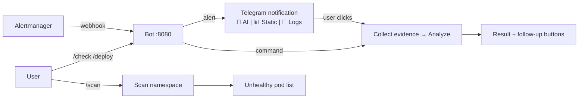

# lazy-diagnose-k8s

Telegram ChatOps bot for Kubernetes diagnosis. Receives alerts from Alertmanager or manual commands, auto-diagnoses using deterministic playbooks, and returns structured results with suggested kubectl commands.

## How It Works



- **Alert mode**: Alertmanager fires → bot sends notification → user clicks action button → investigation runs
- **Manual mode**: User sends `/check` or `/scan` → bot runs analysis → returns result with action buttons
- **No auto-diagnosis on alerts** — saves LLM tokens, user decides what to investigate

## Quick Start

```bash
export TELEGRAM_BOT_TOKEN="your-token"
make run
```

## Commands

| Command | Description |
|---|---|
| `/check <target> [-n ns] [-c cluster]` | Diagnose a specific target |
| `/deploy <deployment> [-c cluster]` | Check rollout status |
| `/scan [namespace] [-c cluster]` | Find all unhealthy pods in a namespace |
| `/help` | Show usage guide |

**Target** can be a pod/deployment name, or a path like `deployment/checkout` or `prod/deployment/checkout`. The bot auto-discovers the namespace via fuzzy pod search.

**Namespace**: auto-detected from fuzzy search. Override with `-n demo-prod` or set `DEFAULT_NAMESPACE` env var.

**Examples:**
```
/check checkout                # diagnose checkout in default ns
/check checkout -n staging     # diagnose in staging
/check checkout -c lazy-diag-2 # diagnose on cluster 2
/deploy payment                # check rollout status
/scan                          # scan default namespace
/scan prod                     # scan specific namespace
```

## Playbooks

| Playbook | Detects |
|---|---|
| **CrashLoop** | OOMKilled, missing config/env, dependency timeout, probe failure, bad image |
| **Pending** | Insufficient resources, taint/toleration mismatch, affinity, PVC binding, quota |
| **Rollout regression** | Release regression, image pull failure, exposed dependency bugs, resource pressure |

## Alertmanager Integration

The bot runs an HTTP server (default `:8080`) that receives Alertmanager webhooks. When an alert fires, the bot:

1. Extracts K8s target from alert labels (pod, deployment, namespace)
2. Runs the same diagnosis pipeline as `/check`
3. Sends alert notification + diagnosis result to configured Telegram chats
4. Attaches inline action buttons (Rerun / Logs / Scan NS)

**Configure via environment variables:**
```bash
export TELEGRAM_CHAT_ID=YOUR_CHAT_ID   # where alerts go (comma-separated for multiple)
```

```yaml
# config.yaml
webhook:
  enabled: true
  addr: ":8080"
  bearer_token: ""  # optional auth
```

**Alert rules included** (`deploy/monitoring/alert-rules.yaml`):
- `KubePodCrashLooping` — CrashLoopBackOff > 1 min
- `KubePodNotReady` — Pending/Unknown > 2 min
- `ContainerOOMKilled` — OOM termination
- `ContainerHighRestartCount` — restarts > 5
- `KubePodImagePullError` — ErrImagePull/ImagePullBackOff > 1 min
- `KubeDeploymentReplicasMismatch` — desired != ready > 3 min

**Alerting stack:**
```bash
kubectl apply -f deploy/monitoring/alert-rules.yaml
kubectl apply -f deploy/monitoring/alertmanager.yaml
kubectl apply -f deploy/monitoring/vmalert.yaml
```

## Inline Action Buttons

When an alert arrives, the bot sends a notification with 3 action buttons — **no auto-diagnosis**, you choose what to run:

| Button | What it does | Uses LLM? |
|---|---|---|
| **🤖 AI Investigation** | Collects evidence, sends to LLM for free-form analysis | Yes |
| **📊 Static Analysis** | Runs deterministic playbook scoring (rule-based) | No |
| **📜 Logs** | Queries VictoriaLogs, shows raw container logs (last 30 min) | No |

After any action, a second row of buttons appears for follow-up:

| Button | Action |
|---|---|
| 🤖 **AI** | Run AI Investigation |
| 📊 **Static** | Run Static Analysis |
| 📜 **Logs** | Show logs |
| 🔍 **Scan NS** | Scan entire namespace |

The `/check` command also shows these buttons after returning results.

## LLM Summarizer

Optional LLM-powered summaries. Without it, the bot uses template-based summaries (deterministic, fast). Works with any OpenAI-compatible endpoint:

```yaml
llm:
  base_url: https://mkp-api.fptcloud.com/v1
  api_key: your-key
  model: gpt-oss-120b
```

Or via env vars:
```bash
export LLM_BASE_URL=https://mkp-api.fptcloud.com/v1
export LLM_API_KEY=your-key
export LLM_MODEL=gpt-oss-120b
```

Enabled automatically when `base_url` + `model` are set.

## Configuration

All config in `configs/config.yaml`. Env vars override config file values.

| Setting | Config key | Env var | Default |
|---|---|---|---|
| Telegram token | `telegram.token` | `TELEGRAM_BOT_TOKEN` | (required) |
| Alert chat IDs | `telegram.alert_chat_ids` | `TELEGRAM_CHAT_ID` | `[]` |
| Webhook enabled | `webhook.enabled` | | `true` |
| Webhook address | `webhook.addr` | | `:8080` |
| VictoriaMetrics | `providers.victoria_metrics_url` | `VICTORIA_METRICS_URL` | `http://localhost:8428` |
| VictoriaLogs | `providers.victoria_logs_url` | `VICTORIA_LOGS_URL` | `http://localhost:9428` |
| Default namespace | | `DEFAULT_NAMESPACE` | `prod` |
| LLM base URL | `llm.base_url` | `LLM_BASE_URL` | (disabled) |
| LLM model | `llm.model` | `LLM_MODEL` | |
| LLM API key | `llm.api_key` | `LLM_API_KEY` | |
| Holmes model | `holmes.model` | `HOLMES_MODEL` | (uses LLM model if unset) |

## Deploy to K8s

```bash
make docker-load    # build image + load into kind

kubectl apply -f deploy/bot/namespace.yaml
kubectl apply -f deploy/bot/rbac.yaml
kubectl apply -f deploy/bot/configmap.yaml

kubectl create secret generic lazy-diagnose-secrets \
  --namespace=lazy-diagnose \
  --from-literal=TELEGRAM_BOT_TOKEN=your-token

kubectl apply -f deploy/bot/deployment.yaml
```

## Test Scenarios

9 pre-built K8s failure scenarios. See [deploy/test-workloads/SCENARIOS.md](deploy/test-workloads/SCENARIOS.md) for details.

```bash
make scenarios          # deploy all scenarios
make scenarios-status   # check pod status vs expected
make scenarios-clean    # remove all
```

| Scenario | Command | Expected |
|---|---|---|
| OOMKilled | `/check checkout` | CrashLoop — OOM / Resource exhaustion |
| Insufficient resources | `/check worker` | Pending — Insufficient cluster resources |
| Config missing | `/check api-config-missing` | CrashLoop — Config / Env missing |
| Probe failure | `/check api-probe-fail` | CrashLoop — Probe misconfiguration |
| Bad image | `/check api-bad-image` | CrashLoop — Bad image / Startup failure |
| Dependency fail | `/check api-dependency-fail` | CrashLoop — Dependency / Connectivity |
| Node selector | `/check ml-worker-taint` | Pending — Affinity / NodeSelector issue |
| PVC not bound | `/check db-pvc-pending` | Pending — PVC binding issue |
| Rollout regression | `/deploy payment` | Rollout — Release caused regression |

## HolmesGPT Deep Investigation

Optional agentic investigation mode. While AI Investigation makes 1 LLM call, Deep Investigation runs an agent loop — the LLM decides what to query (pods, logs, events), queries it, reasons, and repeats until it finds the root cause. Takes 1-2 minutes.

**Requires:** `holmes` CLI installed + a model that supports **function calling** (tool use).

### Install holmes CLI

**pipx (recommended):**
```bash
pipx install holmesgpt
```

**Homebrew (Mac/Linux):**
```bash
brew tap robusta-dev/homebrew-holmesgpt
brew install holmesgpt
```

**From source (no pip):**
```bash
git clone https://github.com/robusta-dev/holmesgpt.git
cd holmesgpt
poetry install --no-root
# Binary: poetry run holmes ask --help
# Symlink into PATH:
ln -s "$(poetry env info -p)/bin/holmes" /usr/local/bin/holmes
```

**Verify:**
```bash
holmes ask --help
```

### Configure

```yaml
# config.yaml — Holmes inherits base_url and api_key from LLM config
holmes:
  enabled: true
  model: SaoLa3.1-medium
  timeout: 120
```

Or env vars:
```bash
export LLM_BASE_URL=https://mkp-api.fptcloud.com/v1
export LLM_API_KEY=your-key
export HOLMES_MODEL=SaoLa3.1-medium
# base_url and api_key inherited from LLM — no separate env vars needed
# "openai/" prefix is auto-added for Holmes CLI (litellm)
```

**FPT AI models with function calling support:**
- `SaoLa3.1-medium` — function calling OK
- `SaoLa-Llama3.1-planner` — function calling OK
- `Qwen2.5-Coder-32B-Instruct` — NO function calling (use for AI Investigation only)

### Usage

After enabling, a 🔬 Deep button appears alongside AI/Static/Logs buttons on alerts and diagnosis results.

## Local Development

See [SETUP.md](SETUP.md) for full local setup (kind + VictoriaMetrics + VictoriaLogs + Alertmanager).

## Documentation

- [Architecture](docs/architecture.md) — system design, modules, design decisions
- [Diagnosis Flow](docs/flow.md) — step-by-step walkthrough of a diagnosis run
- [Test Scenarios](deploy/test-workloads/SCENARIOS.md) — pre-built K8s failure scenarios
- [Local Setup](SETUP.md) — kind cluster + monitoring stack setup guide

## Project Structure

```
cmd/bot/main.go                     Entry point (Telegram + webhook server)
internal/
  adapter/telegram/                 Telegram bot, message formatting, callbacks
  webhook/                          HTTP server for Alertmanager webhooks
  config/                           Config structs + YAML loader
  composer/                         kubectl command generator
  diagnosis/                        Scoring engine + LLM summarizer + redaction
  domain/                           Domain types + intent classifier
  playbook/                         Playbook orchestration
  provider/                         Data collection (K8s, metrics, logs)
  resolver/                         Target resolver (name -> K8s resource)
configs/                            Sample configs (config.yaml, redaction_rules)
deploy/
  bot/                              K8s deployment manifests for the bot
  monitoring/                       kube-state-metrics, vmagent, vlagent, alertmanager, vmalert
  test-workloads/                   Test scenarios (OOM, Pending, Rollout, etc.)
docs/                               Architecture and flow documentation
```

## LLM Endpoint Examples

Any OpenAI-compatible endpoint works. Just set `base_url`, `model`, and `api_key`:

| Provider | Base URL | Example model |
|---|---|---|
| **FPT AI** | `https://mkp-api.fptcloud.com/v1` | `gpt-oss-120b` |
| **Ollama** | `http://localhost:11434/v1` | `gemma3:4b` |
| **OpenRouter** | `https://openrouter.ai/api/v1` | `meta-llama/llama-3.3-70b-instruct:free` |
| **OpenAI** | `https://api.openai.com/v1` | `gpt-4o-mini` |
| **Gemini** | `https://generativelanguage.googleapis.com/v1beta/openai` | `gemini-2.0-flash` |
