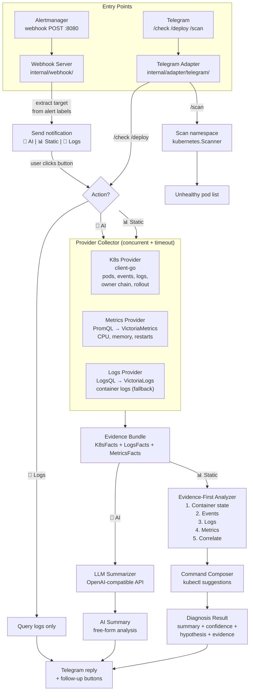

# Architecture

## Overview

lazy-diagnose-k8s is a Telegram bot that diagnoses Kubernetes issues using an **evidence-first** approach. The system collects structured data from K8s API (and optionally metrics/logs backends), analyzes it through deterministic rules that read facts directly from the evidence, and returns structured results with actionable commands.

Key design principle:

> **Read the evidence first. Let the facts determine the diagnosis.**

The bot does not pattern-match text strings or let an LLM decide what to query. Instead, the analyzer reads structured K8s facts (container state, events, logs, metrics) and walks through a fixed analysis sequence. This makes the system predictable, testable, and debuggable.

## System Diagram

### Provider Details

| Provider | Source | Data Collected |
|---|---|---|
| **K8s** (primary) | client-go → K8s API | Pod status, conditions, container state + image + env errors, init containers, current + previous logs, events, owner chain, rollout status, resource requests/limits, node resources |
| **Metrics** | PromQL → VictoriaMetrics | Restart rate, CPU/memory usage + limits |
| **Logs** (fallback) | LogsQL → VictoriaLogs | Container logs, error patterns (used when K8s API logs are empty) |

### Evidence Bundle → Analyzer (5-step)

| Step | Reads | Detects |
|---|---|---|
| 1. Container state | `ContainerStatus.State/Reason/ExitCode` | OOM, ImagePull, CrashLoop, Pending, init fail |
| 2. Events | `K8sEvent.Reason/Message` | FailedScheduling (taints, affinity, PVC, resources), probe failures, image errors |
| 3. Logs | K8s API logs (current + previous) | Config errors, connectivity issues, OOM, permission errors |
| 4. Metrics | CPU/memory usage vs limits, restart rate | Resource exhaustion, high restart rate |
| 5. Correlate | All findings | Multiple sources agreeing → boost confidence (+15 per source) |

## Module Responsibilities

| Module | Path | Responsibility |
|---|---|---|
| **Webhook Server** | `internal/webhook/server.go` | HTTP server for Alertmanager webhooks, parse alerts, extract targets |
| **Alert Notification** | `internal/adapter/telegram/alerts.go` | Format alert messages, build action button keyboards, send notifications (no auto-diagnosis) |
| **Callback Handlers** | `internal/adapter/telegram/callbacks.go` | Handle inline button presses: AI Investigation, Static Analysis, Logs. Results reply to alert message |
| **Telegram Bot** | `internal/adapter/telegram/bot.go` | Message parsing (/check, /deploy, /scan), fuzzy search fallback, per-user rate limiting, progress updates |
| **K8s Scanner** | `internal/provider/kubernetes/scanner.go` | Namespace scanning (all non-system or specific), fuzzy pod search by name/owner/label |
| **Intent Classifier** | `internal/domain/intent.go` | Classify user message into crashloop/pending/rollout/unknown |
| **Target Resolver** | `internal/resolver/resolver.go` | Map user input to concrete K8s resource via exact match or fuzzy search |
| **Playbook Engine** | `internal/playbook/playbook.go` | Orchestrate the full diagnosis run, coordinate providers and analyzer |
| **Provider Collector** | `internal/provider/provider.go` | Concurrent data collection with timeout + degraded mode |
| **K8s Provider** | `internal/provider/kubernetes/k8s.go` | Pod status, conditions, containers, init containers, env ref errors, current+previous logs, events, owner chain, rollout, resources, node resources — all via client-go |
| **Metrics Provider** | `internal/provider/metrics/metrics.go` | PromQL queries to VictoriaMetrics |
| **Logs Provider** | `internal/provider/logs/logs.go` | LogsQL queries to VictoriaLogs (fallback for container logs) |
| **Evidence-First Analyzer** | `internal/diagnosis/analyzer.go` | 5-step analysis: container state, events, logs, metrics, correlate. Replaces old text-pattern matching |
| **Diagnosis Engine** | `internal/diagnosis/engine.go` | Legacy hypothesis scoring engine (still used by playbook) |
| **Summarizer** | `internal/diagnosis/summarizer.go` | LLM-based summarization (OpenAI-compatible API) |
| **Redactor** | `internal/diagnosis/redact.go` | Strip sensitive data (tokens, passwords, keys) from evidence |
| **Command Composer** | `internal/composer/composer.go` | Generate kubectl commands based on diagnosis |
| **Config** | `internal/config/config.go` | YAML config loading (LLM settings, providers, webhook, etc.) |
| **Domain** | `internal/domain/types.go` | Shared types (Target, EvidenceBundle, DiagnosisResult, K8sFacts, ContainerStatus) |

## Key Design Decisions

### Evidence-first analysis, not text-pattern matching

The analyzer reads structured K8s facts directly (container state, exit codes, event reasons) instead of matching text patterns against stringified output. The analysis follows a fixed 5-step sequence:

1. **Container state** — Is it OOMKilled? ImagePullBackOff? CrashLoopBackOff? Pending? Init container failed?
2. **Events** — FailedScheduling (with sub-causes: taints, affinity, PVC, resources)? Probe failures? Image errors?
3. **Logs** — K8s API logs (current + previous) scanned for config errors, connectivity issues, OOM, permissions
4. **Metrics** — Memory near limit? High restart rate?
5. **Correlate** — Multiple sources agreeing on same root cause boosts confidence (+15 per additional source)

Each step produces a `finding` with an ID, score, and signal list. The correlation step picks the highest-scoring finding and boosts it if other steps independently agree.

### Logs from K8s API first, VictoriaLogs as fallback

Container logs are fetched directly from the K8s API (current + previous container) as part of the K8s provider. This means logs are available even when VictoriaLogs is down or not configured. VictoriaLogs is only consulted if K8s API logs are empty — it serves as a fallback for historical or aggregated log data.

### Alert notification, not auto-diagnosis

When an alert fires, the bot sends a **notification only** — no automatic diagnosis. The user chooses what to run via inline buttons:
- **AI Investigation** — collects evidence, sends to LLM for free-form analysis
- **Static Analysis** — collects evidence, runs evidence-first analyzer rules
- **Logs** — queries VictoriaLogs, shows raw container logs

This prevents token waste from auto-running LLM on every alert, and gives the operator control over what investigation method to use. Callback results are sent as native Telegram replies to the alert notification message, keeping the conversation threaded.

### Concurrent providers with degraded mode

All three providers (K8s, metrics, logs) run in parallel with individual timeouts. If one fails, the others still contribute. Confidence is automatically degraded when data is missing. The K8s provider is the most critical — it provides container state, events, and logs all in one call.

### Fuzzy pod search as resolver fallback

When `/check foo` doesn't match an exact resource name, the bot falls back to fuzzy pod search across the cluster. Matching scores: exact name (100) > prefix (80) > contains (60) > owner name (50) > app label (40). High-confidence matches (score >= 80) are used directly; lower matches are presented as suggestions.

### Namespace scanning

`/scan` with no argument scans all non-system namespaces (skips kube-system, kube-public, kube-node-lease, local-path-storage, monitoring). `/scan -n prod` scans a specific namespace. Results are deduplicated by owner.

### OpenAI-compatible LLM interface

The summarizer uses the OpenAI chat completions API format, which works with Ollama (local), Gemini, OpenRouter, OpenAI, and any compatible endpoint. No vendor lock-in.

### Direct API calls over MCP

The bot uses direct API calls (client-go, HTTP) instead of MCP servers. This is simpler, more reliable, and easier to test.

### Two entry points, one pipeline

Both Alertmanager webhooks and user commands feed into the same evidence collection and analysis pipeline. The alert flow adds a notification + button layer; the manual flow goes directly to analysis.

### Read-only by design

The bot never writes to the cluster. It only reads pod status, events, metrics, and logs. Suggested commands (rollback, restart) are presented as copy-paste text, not executed automatically. This is a deliberate security boundary — the operator decides whether to act.
